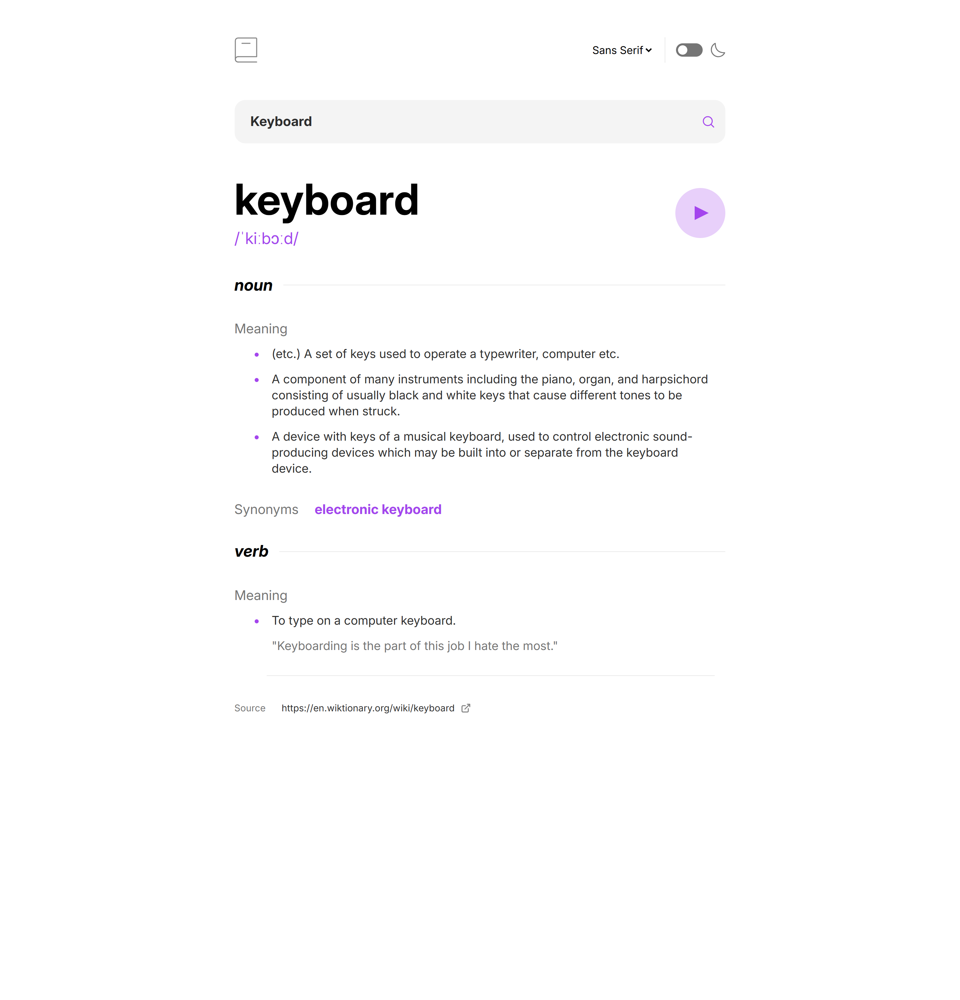

# Frontend Mentor - Dictionary web app solution

This is a solution to the [Dictionary web app challenge on Frontend Mentor](https://www.frontendmentor.io/challenges/dictionary-web-app-h5wwnyuKFL). Frontend Mentor challenges help you improve your coding skills by building realistic projects.

## Table of contents

- [Overview](#overview)
  - [The challenge](#the-challenge)
  - [Screenshot](#screenshot)
  - [Links](#links)
- [My process](#my-process)
  - [Built with](#built-with)
  - [What I learned](#what-i-learned)
  - [Continued development](#continued-development)
  - [Useful resources](#useful-resources)
- [Author](#author)
- [Acknowledgments](#acknowledgments)

**Note: Delete this note and update the table of contents based on what sections you keep.**

## Overview

### The challenge

Users should be able to:

- Search for words using the input field
- See the Free Dictionary API's response for the searched word
- See a form validation message when trying to submit a blank form
- Play the audio file for a word when it's available
- Switch between serif, sans serif, and monospace fonts
- Switch between light and dark themes
- View the optimal layout for the interface depending on their device's screen size
- See hover and focus states for all interactive elements on the page
- **Bonus**: Have the correct color scheme chosen for them based on their computer preferences. _Hint_: Research `prefers-color-scheme` in CSS.

### Screenshot



### Links

- Solution URL: [Solution URL](https://github.com/nishanth1596/dictionary)
- Live Site URL: [Live site URL](https://nishanth-dictionary.netlify.app/)

### Features

- **Responsive Design**: The card layout adapts seamlessly from mobile to desktop view.
- **Dynamic Content**: Components are reusable, making it easy to extend the functionality or update the content.

### Installation

To run this project locally:

1. Clone this repository:

   ```bash
   git clone  https://github.com/nishanth1596/dictionary
   ```

2. Navigate into the project directory:
   cd dictionary

3. Install dependencies:
   npm install

4. Start the development server:
   npm run dev

5. Open the project in your browser at http://localhost:5173

## My process

### Built with

- Semantic HTML5 markup
- Tailwind CSS
- Flexbox
- Grid
- Mobile-first workflow
- Typescript
- [React](https://reactjs.org/) - JS library

### What I learned

This project helped me become more comfortable with TypeScript, Tailwind CSS, and its utility-first approach to styling. It also deepened my understanding of Flexbox and Grid layout techniques.

### Continued development

I would like to continue practicing more complex layout techniques, especially working with Flexbox and Grid, and further improve my TypeScript skills.

### Useful resources

MDN Web Docs - Flexbox & Grid - This documentation helped me understand Flexbox better.
Tailwind CSS Documentation
Google Fonts - I used the SansSerif, Serif and mono fonts from Google Fonts to style the text.

### Author

- Name: Nishanth
- Website - [My GitHub Profile](https://github.com/nishanth1596)
- Frontend Mentor - [@nishanth1596](https://www.frontendmentor.io/profile/nishanth1596)
- Twitter - [@nishanth1596](https://x.com/nishanth1596)
